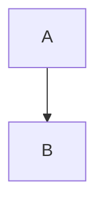
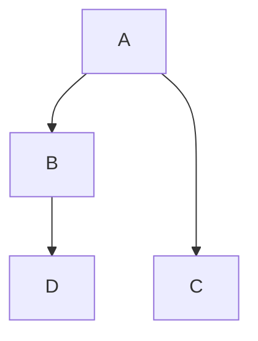
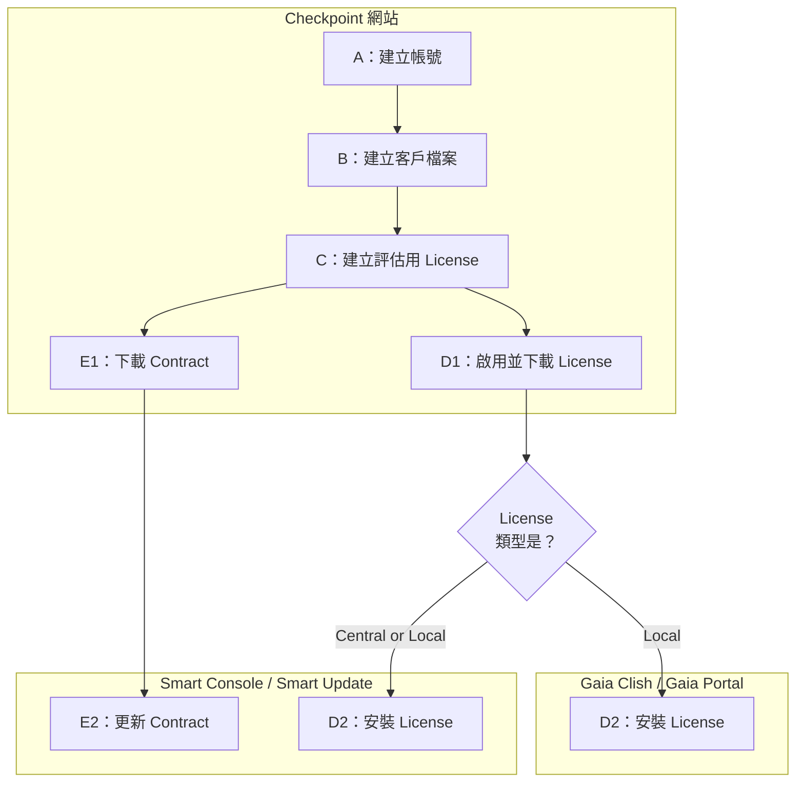

```mermaid
graph TD;

A --> B
```

```mermaid
graph TD;

A --> B --> D
A ---> C

```

```mermaid
graph TD
    A --> B
    B --> C
    C --> E1
    E1 --> E2
    C --> D1
    D1 --> DD
    DD -->|"Central or Local"| D2-1
	DD -->|"Local"| D2-2
    
	DD{"License\n類型是？"}
	subgraph Checkpoint 網站
		A["A：建立帳號"]
		B["B：建立客戶檔案"]
		C["C：建立評估用 License"]
		D1["D1：啟用並下載 License"]
		E1["E1：下載 Contract"]
	end
    
	subgraph Smart Console / Smart Update
		D2-1["D2：安裝 License"]
		E2["E2：更新 Contract"]
	end
    
	subgraph Gaia Clish / Gaia Portal
		D2-2["D2：安裝 License"]
	end
```